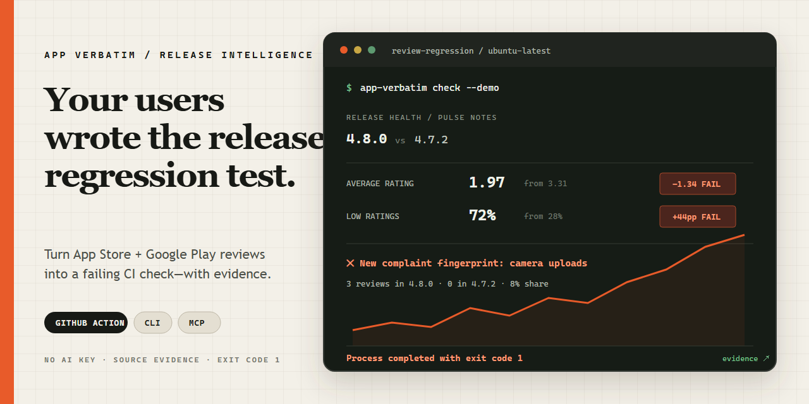

# App Verbatim



**从 App Store 和 Google Play 用户评论中发现版本回归，并直接把它变成 CI 质量门。**

App Verbatim 会比较相邻应用版本的评论证据，识别评分下跌、低分激增和投诉主题变化，并把低分评论分成软件故障、产品策略、社区治理、客服和信息不明确五类。只有“门禁失败 + 重复软件症状 + 版本关联证据”才会升级为明确的软件回归；其他异常仍保持阻断并进入人工复核。全程本地、确定性运行，不需要 AI Key，每个结论都保留原始评论证据。

[示例证据报告](https://nike232.github.io/app-verbatim-core/) · [English](README.md) · [GitHub Action 文档](docs/GITHUB_ACTION.md)

## 30 秒看到效果

```bash
npx --yes github:Nike232/app-verbatim-core check --demo
```

内置场景会比较 `4.8.0` 与 `4.7.2`，发现：

- 平均评分下降 1.34 星；
- 一、二星占比上升 44 个百分点；
- 崩溃投诉占比明显增长；
- 预设分类外出现新的 `camera uploads` 问题指纹；
- 分诊为 `SOFTWARE REGRESSION`，并展示当前版本各类低分评论占比与重复的软件症状；
- 命令返回退出码 `1`，可以直接阻断 CI。

检查真实应用：

```bash
npx --yes github:Nike232/app-verbatim-core check \
  "https://play.google.com/store/apps/details?id=notion.id" \
  --country US --language en --limit 300
```

在一次带时间戳的真实检查中，这个命令在 Notion 的 **Google Play 与 Apple App Store** 评论样本里都标记出了潜在版本回归。[真实案例](docs/CASE_STUDY_NOTION.md)公开了样本量、阈值、复现命令和局限性。

## 一条命令接入仓库

在你的移动应用仓库中运行：

```bash
npx --yes github:Nike232/app-verbatim-core init \
  "https://play.google.com/store/apps/details?id=YOUR.APP.ID" \
  --observe-only \
  --create-issue
```

命令会验证并规范化商店 URL，然后生成 `.github/workflows/app-verbatim.yml`：每日定时检查、手动触发、最小权限和去重回归 Issue 都已配置。已有文件不会被静默覆盖；需要固定不可变版本时可加 `--action-ref v0.5.9`。

推荐命令默认采用观察模式：工作流仍会输出回归证据并维护 Issue，但在了解应用的正常评论量期间保持绿色。策略适配后，删掉生成的 `fail-on-regression: false` 即可转为质量门；只有明确想从首次运行就阻断时才省略 `--observe-only`。

## GitHub Actions

```yaml
name: App review regression

on:
  workflow_dispatch:
  schedule:
    - cron: "17 8 * * *"

permissions:
  contents: read
  issues: write

jobs:
  review-health:
    runs-on: ubuntu-latest
    steps:
      - uses: Nike232/app-verbatim-core@v0
        with:
          app-url: https://play.google.com/store/apps/details?id=YOUR.APP.ID
          create-issue: true
          github-token: ${{ secrets.GITHUB_TOKEN }}
```

Action 会生成 GitHub Job Summary 和机器可读 JSON；超过阈值时工作流失败，并创建或更新同一个回归 Issue，不会重复刷屏。

## 让 Agent 直接调用

App Verbatim 同时提供本地 MCP Server。把下面的命令加入支持 stdio 的 MCP 客户端：

```json
{
  "mcpServers": {
    "app-verbatim": {
      "command": "npx",
      "args": ["--yes", "github:Nike232/app-verbatim-core", "mcp"]
    }
  }
}
```

Agent 可以调用三个只读工具：版本回归检查、单个应用评论分析、两个应用竞品对比。所有结果都附带评论证据，不需要额外的模型 API Key。详细说明见 [MCP 文档](docs/MCP.md)。

## 核心能力

- App Store 与 Google Play 公共评论连接器；
- 真实最新版本与有足够样本的历史基线之间的评分、低分占比和投诉主题回归检测；主题门禁只使用一至三星的问题证据，正面主题提及和明确的能力需求不会阻断发布，即使需求文本同时提到某个问题分类；最新版本样本不足时明确保持“证据不足”；
- 版本关联证据层：把明确提到更新/版本的评论与仅描述“以前可以、现在不行”的时间变化分开统计；它只校准因果判断强度，不会过滤低分或暗中放宽门禁；
- 保守的可行动分诊层：低分评论分为软件故障、产品策略/定价、社区/内容治理、客服、无有效信息五类；只有重复且带版本关联的软件症状才标为 `software-regression`，其余门禁异常标为 `manual-review`，二者都保持阻断；
- 预设分类之外的低分问题指纹发现；
- 原始评论证据、数据去重和 SHA-256 来源哈希；
- CLI、Node.js API、GitHub Action、本地 MCP Server 和自定义 Connector SDK；
- JSON、CSV、Markdown、独立 HTML 报告；
- 带质量门槛的六语言主题、版本关联与可行动分诊透明评测集、20 应用真实队列、Apple/Google × 美德地区的 40 案例验证矩阵、跨平台 CI 和真实商店契约测试。

## 本地开发与验证

```bash
git clone https://github.com/Nike232/app-verbatim-core.git
cd app-verbatim-core
npm ci
npm run check
```

生成离线报告：

```bash
npm run start -- demo --compare --output report.html
```

完整参数请查看 [English README](README.md)、[Connector API](docs/CONNECTOR_API.md) 和 [报告结构](docs/REPORT_SCHEMA.md)。

## 开源与商业版边界

本仓库完整开放连接器、标准化模型、版本质量门、证据、确定性分析与新问题发现、导出器、CLI、GitHub Action、MCP Server、扩展 API、评测集和测试。

托管调度、长期历史、团队权限、私有 Owner API、托管通知及商业运营能力属于独立的私有 Pro 产品。本仓库不会放置隐藏的 Pro 分支。

Apple 连接器优先使用公开评论 RSS；当 RSS 返回空结果时，会回退到 Apple 公共商店页面展示的评论。当前回退最多提供 10 条可见评论，且不包含应用版本字段；后续 RSS 分页持续为空时也会标记为来源不完整。因此版本回归检查会明确报告“证据不足”，不会用截断样本猜测通过或失败。公开商店行为可能变化，连接器仍需要持续维护。

许可证为 GNU AGPL-3.0-or-later。数据采集和使用时请遵守平台条款及适用法律。
